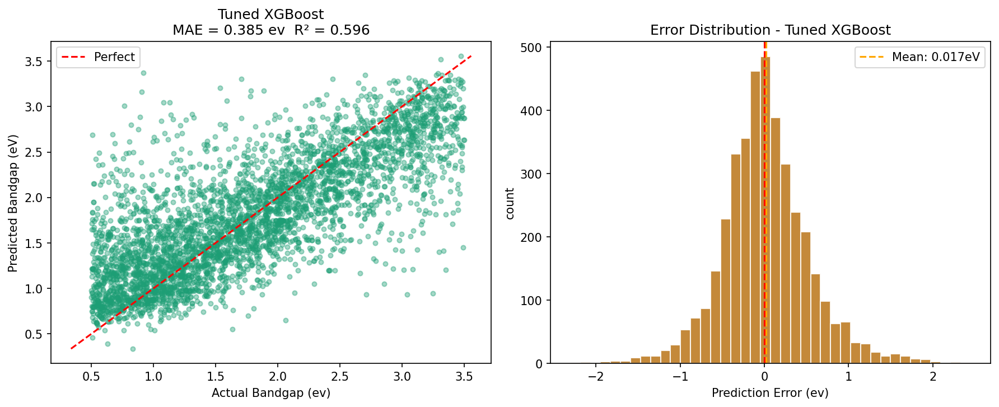
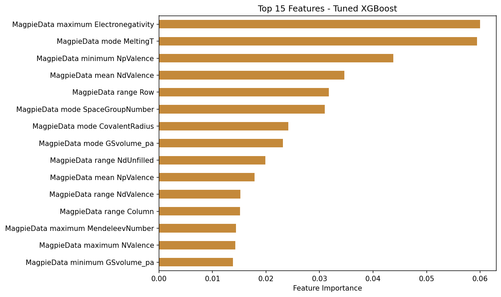

# ML Bandgap Predictor

Predicting electronic bandgap of crystalline materials from chemical
composition using machine learning, trained on Materials Project data.

## Problem

Bandgap is a critical property for semiconductor and solar cell
materials. DFT calculations are accurate but computationally
expensive. This project trains an ML model to predict bandgap
directly from chemical composition, enabling rapid screening of
candidate materials without running DFT for every candidate.

## Dataset

- **Source:** Materials Project (materialsproject.org)
- **Size:** [500] crystal structures
- **Features:** 145 Magpie composition descriptors (matminer)
- **Target:** DFT-calculated bandgap (eV)

## Methods

1. Downloaded crystal structures via Materials Project API
2. Cleaned data — removed outliers, missing values, duplicates
3. Generated 145 composition-based features using matminer
   (ElementProperty, Magpie preset)
4. Trained and compared 4 models: Baseline, Linear Regression,
   Random Forest, XGBoost
5. Tuned XGBoost hyperparameters using GridSearchCV
6. Evaluated all models using 5-fold cross-validation

## Results

| Model                  | MAE (eV)        |
|-------------------------|-----------------|
| Baseline (predict mean) | 0.6976          |
| Linear Regression       | 0.5876          |
| Random Forest           | 0.469 ± 0.011   |
| XGBoost (tuned)          | **0.466 ± 0.010** |

**Best model: XGBoost** — MAE of 0.466 ± 0.010 eV via 5-fold
cross-validation, a [0.7]% improvement over the naive baseline.



## Key Finding

Electronegativity-related features were consistently the strongest
predictors of bandgap across both Random Forest and XGBoost models.
This is physically consistent — larger electronegativity differences
between elements indicate more ionic bonding character, which
correlates with wider electronic bandgaps.



## Repository Structure

```
ml-materials/
├── day1_setup.ipynb              # environment + first plots
├── day2_pandas_cleaning.ipynb     # data cleaning + outlier removal
├── day3_pymatgen.ipynb            # crystal structure analysis
├── day4_first_ml_model.ipynb      # Magpie features + baseline models
├── day5_xgboost.ipynb             # XGBoost + hyperparameter tuning
├── materials_clean.csv           # cleaned dataset
├── features_ready.csv            # 145 Magpie features
├── *.png                         # result figures
└── README.md
```

## How to Run

```bash
conda create -n matml python=3.11
conda activate matml
pip install -r requirements.txt
jupyter notebook
```

Get a free Materials Project API key at materialsproject.org
to re-run the data download steps.

## Tools Used

Python · pandas · NumPy · matplotlib · pymatgen · matminer ·
scikit-learn · XGBoost · Materials Project API · Git/GitHub

## Author

Sandesh Reddy  — B.Tech Metallurgical and Materials Engineering,
NITK Surathkal
