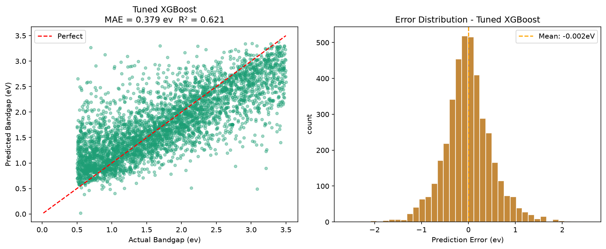
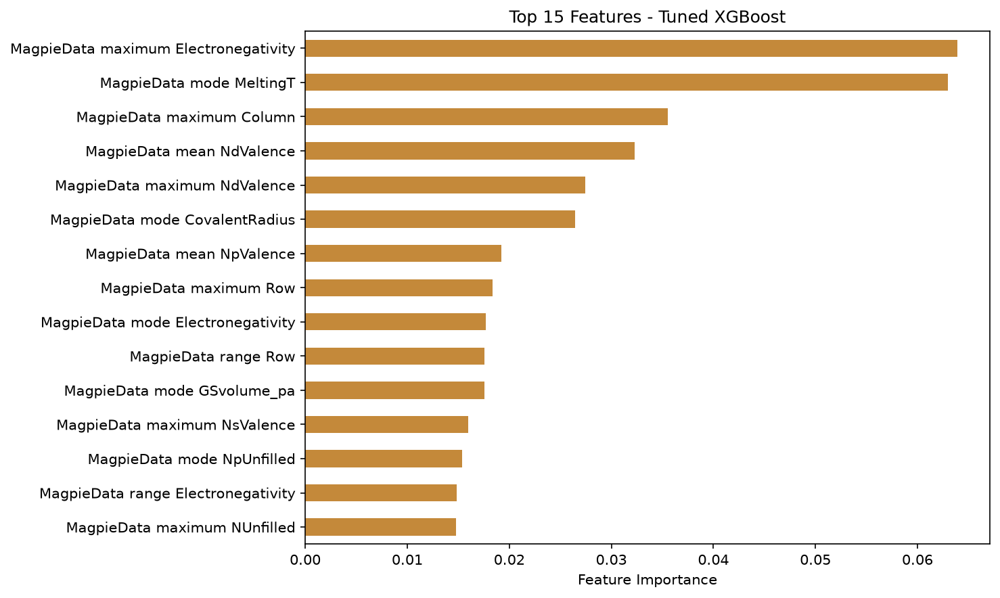

# ML Bandgap Predictor

Predicts electronic bandgap of crystalline materials from chemical
composition using machine learning, trained on Materials Project data.

## Problem

Bandgap is a critical property for semiconductor and solar cell
materials. DFT calculations are accurate but computationally
expensive. This project trains an ML model to predict bandgap
directly from chemical composition, enabling rapid screening of
candidate materials without running DFT for every candidate.

## Dataset

- **Source:** Materials Project (materialsproject.org)
- **Dataset:** Materials Project crystal structures
- **Scope:** Semiconductors with band gaps between 0.5–3.5 eV (see
  Limitations below)
- **Features:** 132 Magpie composition descriptors (matminer)
- **Target:** DFT-calculated bandgap (eV)

## Methods

1. Downloaded crystal structures via Materials Project API
2. Cleaned data — removed outliers, missing values, duplicates
3. Generated 132 composition-based features using matminer
   (ElementProperty, Magpie preset)
4. Trained and compared 5 models: Baseline, Linear Regression,
   Random Forest, XGBoost (default), XGBoost (tuned)
5. Tuned XGBoost hyperparameters using GridSearchCV
6. Evaluated all models using 5-fold cross-validation for a fair,
   consistent comparison
## Results

| Model                    | MAE (eV)          |
|---------------------------|--------------------|
| Baseline (predict mean)   | 0.7072             |
| Linear Regression         | 0.5919             |
| Random Forest (5-CV)      | 0.492 ± 0.032      |
| XGBoost default (5-CV)    | 0.489 ± 0.032      |
| XGBoost tuned (5-CV)      | **0.487 ± 0.035**  |

**Best-performing model in cross-validation:** XGBoost (tuned), with an MAE of
**0.487 ± 0.035 eV** via 5-fold cross-validation, representing roughly a
31% improvement over the naive baseline.

**Model deployed in the web application:** Random Forest, with a 5-fold
cross-validation MAE of **0.492 ± 0.032 eV**.

The Random Forest and XGBoost models perform comparably on this dataset,
with only a small difference in MAE. Random Forest was selected for the
deployed application because its existing prediction pipeline was stable
and validated.



## Key Finding

Electronegativity-related features were consistently the strongest
predictors of bandgap across both Random Forest and XGBoost models.
This is physically consistent — larger electronegativity differences
between elements indicate more ionic bonding character, which
correlates with wider electronic bandgaps.



## Limitations

Model is trained on 0.5–3.5 eV band gaps only. Tested on known
semiconductors outside this range (e.g. ZnO, InSb) and predictions
were unreliable — tree models can't extrapolate beyond their training
range. Best used for materials expected to fall within 0.5–3.5 eV.

## Repository Structure

```
ml-materials/
├── 01_data_collection.ipynb              # environment + first plots
├── 02_data_cleaning.ipynb     # data cleaning + outlier removal
├── 03_structure_analysis.ipynb           # crystal structure analysis
├── 04_feature_engineering.ipynb      # Magpie features + baseline models
├── 05_model_training.ipynb             # XGBoost + hyperparameter tuning
├── *.png                         # result figures
└── README.md
```

## How to Run

```bash
conda create -n matml python=3.11
conda activate matml
pip install -r requirements.txt
jupyter notebook
```

Get a free Materials Project API key at materialsproject.org
to re-run the data download steps.

## Tools Used

Python · pandas · NumPy · matplotlib · pymatgen · matminer ·
scikit-learn · XGBoost · Materials Project API · Git/GitHub

## Author

Sandesh Reddy  — B.Tech Metallurgical and Materials Engineering,
NITK Surathkal
